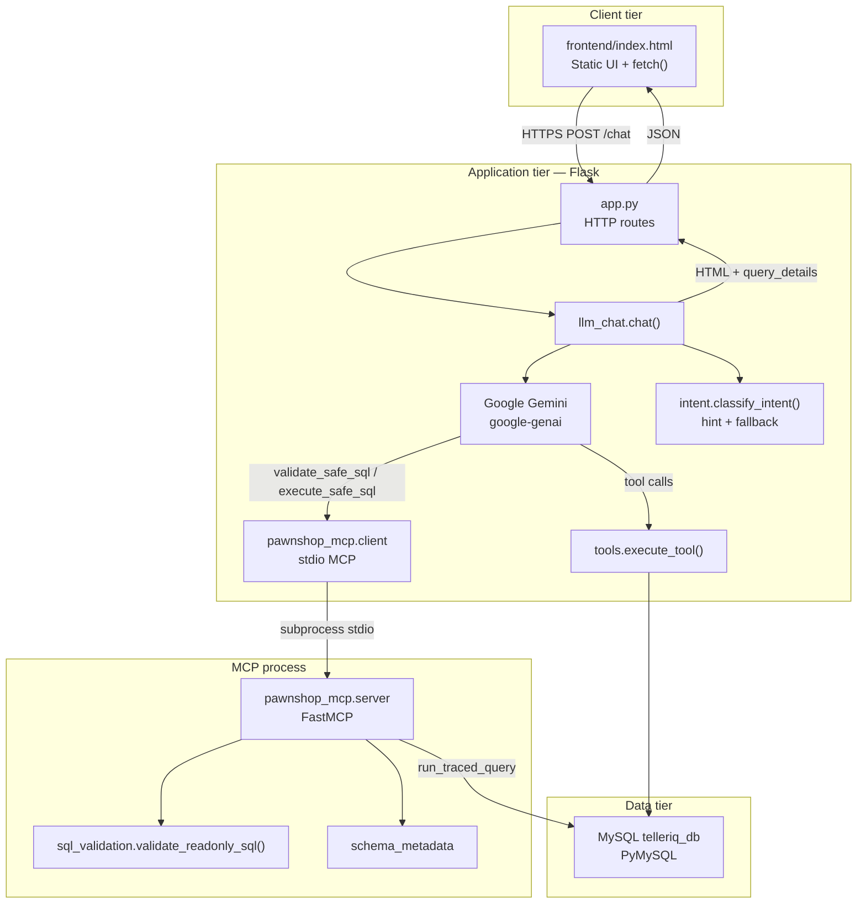
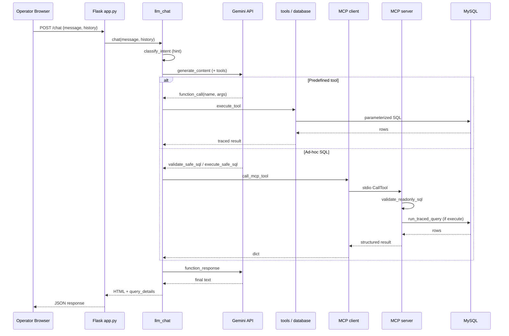
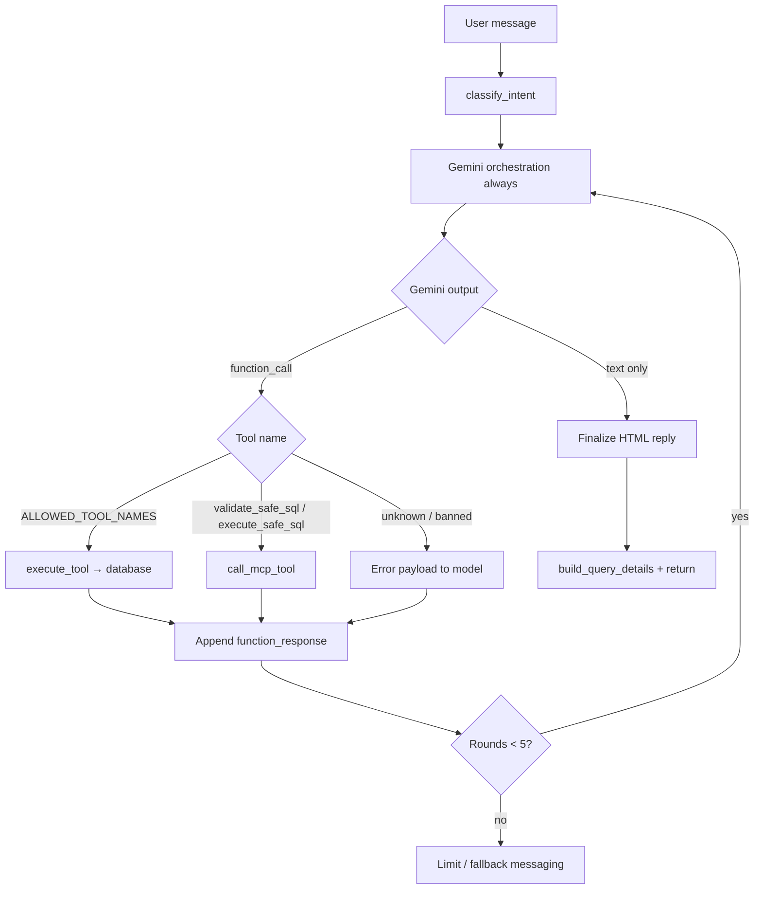
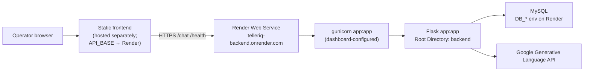

# TellerIQ Architecture Design Document

| Field | Value |
|-------|-------|
| Document title | TellerIQ Architecture Design Document |
| System | TellerIQ — Pawnshop Operations Assistant |
| Repository | `pawnshop-chatbot` |
| Baseline revision | `133ce75` (*Revert Claude integration and restore Gemini SQL flow*) |
| Document date | 2026-07-29 |
| Classification | Technical — internal review |

---

## 1. Project Overview

TellerIQ is a conversational operations assistant for pawnshop / lending workflows. Operators ask natural-language questions about customers, payments, loans, collateral, and daily priorities. The system answers using live MySQL data, never inventing balances or names.

**Primary capabilities present in the codebase:**

- Natural-language chat over portfolio and customer data
- Predefined operational lookup tools (overdue, due-soon, high LTV, collateral at risk, etc.)
- Ad-hoc read-only SQL via Gemini-authored queries validated and executed through an MCP layer
- HTML responses with optional query/audit details for the UI
- Health check against the expected database schema

**Product surface (frontend):** branded operations dashboard with portfolio stat cards, shortcut prompts, and a chat answer panel (“Business Summary”, “Recommended Action”, results table, collapsible technical audit). Footer copy states: *Powered by Gemini, Flask, and MySQL*.

**Out of scope for this document (not present as active integrations):** Claude / Anthropic text-to-SQL (`sql_generation.py` and `generate_safe_sql` were removed in `133ce75`), checked-in Render/Vercel IaC, and confirmed AWS Lambda/RDS deployment (notes list AWS resources as pending).

---

## 2. High-Level Architecture

TellerIQ is a three-tier web application:

1. **Presentation** — static HTML/CSS/JS frontend  
2. **Application** — Flask API that orchestrates Gemini and tools  
3. **Data** — MySQL (`telleriq_db`) accessed via PyMySQL, either through predefined query helpers or MCP-validated SQL  



---

## 3. Technology Stack

| Layer | Technology | Evidence |
|-------|------------|----------|
| Frontend | Single-page HTML/CSS/JS | `frontend/index.html` |
| Backend | Flask, flask-cors | `backend/app.py`, `requirements.txt` |
| WSGI (deploy) | gunicorn (dependency present; start command configured outside repo) | `requirements.txt` |
| LLM | Google Gemini via `google-genai` | `llm_chat.py`, default model `gemini-2.5-flash` |
| Config | `python-dotenv` | `app.py` `load_dotenv()` |
| Database driver | PyMySQL | `database.py` |
| MCP | `mcp` SDK FastMCP + stdio client | `pawnshop_mcp/` |
| HTML from Gemini text | `markdown`, `bleach` | `gemini_text_html.py` |
| Database | MySQL schema `telleriq_db` | `.env.example`, `verify_schema` |

**Environment variables used by the application:**

| Variable | Role |
|----------|------|
| `DB_HOST`, `DB_USER`, `DB_PASSWORD`, `DB_NAME` | Required for `get_connection()` |
| `DB_PORT` | Optional (default `3306`) |
| `GEMINI_API_KEY` | Required for Gemini client |
| `GEMINI_MODEL` | Optional (default `gemini-2.5-flash`) |
| `TELLERIQ_DEBUG` | Optional debug payload in chat responses |

---

## 4. System Components

### 4.1 Frontend

- **Artifact:** `frontend/index.html`
- **Backend base URL:** `API_BASE = "https://telleriq-backend.onrender.com"`
- **Chat:** `sendMessage()` → `POST ${API_BASE}/chat` with `{ message, history }`
- **UI responsibilities:** question input, suggested prompts, rendering HTML replies, optional technical audit from `query_details`, portfolio date display
- **Note:** The working tree contains an uncommitted change to load stats via `GET /dashboard/stats`. Committed `HEAD` historically loaded stats through parallel `/chat` calls. This document treats `/dashboard/stats` as a **local working-tree addition**, not as a committed production contract unless deployed separately.

### 4.2 Flask Backend

- **Entry module:** `backend/app.py`
- **WSGI callable:** `app = Flask(__name__)`
- **Responsibilities:** CORS, UTF-8 JSON charset, route dispatch, startup schema check when run as `__main__`
- **Chat orchestration:** delegated to `llm_chat.chat()`

### 4.3 Gemini LLM

- **Module:** `backend/llm_chat.py`
- **Client:** lazy `genai.Client` in `_get_gemini_client()`
- **Role:** primary conversation planner and final-answer author
- **Tool loop:** up to `MAX_TOOL_ROUNDS = 5` rounds of `generate_content` with function declarations
- **System instruction:** `SYSTEM_PROMPT` + untrusted classifier hint + approved schema reference text

### 4.4 Claude SQL Generation

**Not currently integrated.**

- Commit `133ce75` removed `backend/sql_generation.py`, Anthropic dependency, and any `generate_safe_sql` orchestration.
- Ad-hoc SQL is authored by **Gemini** as arguments to MCP tools `validate_safe_sql` / `execute_safe_sql`.

### 4.5 MCP Layer

| File | Role |
|------|------|
| `pawnshop_mcp/server.py` | FastMCP server: schema resource + SQL tools |
| `pawnshop_mcp/client.py` | Sync wrapper spawning stdio server via `python -m pawnshop_mcp.server` |
| `pawnshop_mcp/constants.py` | `SERVER_NAME`, `SCHEMA_RESOURCE_URI` |

**Exposed MCP surface:**

- Resource `pawnshop://schema/approved` → `get_approved_schema()`
- Tool `validate_safe_sql(sql)`
- Tool `execute_safe_sql(sql)` → validate, then `database.run_traced_query`

**Transport:** stdio subprocess; client passes `env=os.environ.copy()` so Render-injected DB credentials reach the child process.

### 4.6 Predefined Tools

Defined in `backend/tools.py` (`TOOL_DEFINITIONS` / `ALLOWED_TOOL_NAMES`), executed by `execute_tool()` → `database.py` helpers.

Includes (complete set):  
`search_customers`, `get_customer_accounts`, `get_customer_loans`, `get_customer_payments`, `get_customer_collateral`, `get_overdue_customers`, `get_due_soon_customers`, `get_due_today_customers`, `get_due_tomorrow_customers`, `get_due_this_week_customers`, `get_missed_payments`, `get_high_risk_loans`, `get_collateral_at_risk`, `get_today_priorities`, `list_customers`, `get_customer_count`, `get_loan_count`, `get_account_count`, `get_total_overdue_amount`, `get_total_portfolio_balance`, `get_portfolio_summary`.

### 4.7 MySQL Database

- **Logical database name:** `telleriq_db`
- **Access:** `database.get_connection()` via PyMySQL `DictCursor`
- **Schema enforcement:** `verify_schema()` against `REQUIRED_SCHEMA`
- **Approved MCP tables:** `customers`, `accounts`, `loans`, `payments`, `collateral_items`

---

## 5. End-to-End Request Flow

1. User submits a question in the UI (`sendMessage`).
2. Browser `POST`s JSON to `/chat`.
3. `chat_endpoint` validates `message` and calls `llm_chat.chat(message, history)`.
4. `classify_intent(message)` produces an `IntentClassification` (hint / fallback metadata).
5. `_chat_with_gemini` builds contents + tool declarations and calls Gemini.
6. If Gemini returns function calls:
   - Predefined tool → `tools.execute_tool` → SQL helpers in `database.py`
   - `validate_safe_sql` / `execute_safe_sql` → `call_mcp_tool` → MCP server → validation / `run_traced_query`
7. Tool results are returned to Gemini as function responses; loop continues (max 5 rounds).
8. Final Gemini text is converted to HTML (`gemini_text_html` / formatting helpers).
9. `build_query_details` attaches audit metadata.
10. JSON `{ reply, format, history_text, tools_used, query_details, ... }` returns to the UI for rendering.

**Gemini unavailable path:** transient API failures may invoke operational fallback (`gemini_fallback` + `_execute_operational_if_ready`) when the classifier result is executable without the LLM.

---

## 6. Component Interaction Diagram



---

## 7. API Endpoints

| Method | Path | Handler | Behavior |
|--------|------|---------|----------|
| `GET` | `/` | `home` | Liveness JSON: backend running |
| `GET` | `/health` | `health` | Calls `verify_schema()`; `200` ok or `503` on failure |
| `POST` | `/chat` | `chat_endpoint` | Requires `message`; returns chat payload or `400`/`500` |
| `GET` | `/dashboard/stats` | `dashboard_stats_endpoint` | **Present in working tree** (`get_dashboard_stats`); not part of committed `133ce75` `app.py` |

**Chat request body:** `{ "message": string, "history": optional array of {role, content} }`  

**Chat success fields (representative):** `reply`, `format`, `history_text`, `tools_used`, `query_details`, `question`; optional `debug` when `TELLERIQ_DEBUG` is enabled.

---

## 8. Database Architecture

### 8.1 Connection

```text
pymysql.connect(
  host=DB_HOST, user=DB_USER, password=DB_PASSWORD,
  database=DB_NAME, port=DB_PORT|3306,
  cursorclass=DictCursor
)
```

No SSL options are configured in `get_connection()`.

### 8.2 Required / approved schema

**`REQUIRED_SCHEMA` / MCP-approved tables:**

| Table | Representative columns |
|-------|------------------------|
| `customers` | `customer_id`, `full_name`, `phone`, `email` |
| `accounts` | `customer_id`, `account_type`, `balance`, `status` |
| `loans` | `loan_id`, `customer_id`, `loan_type`, `current_balance`, `collateral_value`, `next_due_date` |
| `payments` | `loan_id`, `amount_due`, `amount_paid`, `due_date` |
| `collateral_items` | `loan_id`, `item_type`, `item_description`, `appraised_value`, `item_status`, `forfeiture_date` |

**Computed fields (metadata):** `remaining_due` on payments; `ltv_percent` on loans.  
**Restricted by default in SQL validator:** `phone`, `email`.

### 8.3 Access patterns

1. **Predefined tools** — fixed SQL in `database.py` with parameters.  
2. **MCP execute** — single validated `SELECT` via `run_traced_query`.  
3. **Tracing** — results wrapped with SQL/table metadata for UI audit (`query_trace`).

---

## 9. LLM and Tool Routing Flow



**Routing principles encoded in code:**

- Gemini is the primary planner (`chat` always enters `_chat_with_gemini`).
- Classifier confidence supports hints and operational fallback when Gemini is unavailable — not a separate primary path that bypasses Gemini on success.
- Prompt instructs preference for predefined tools; MCP SQL only when needed.
- No Claude routing path exists in the current tree.

---

## 10. Security and SQL Validation

| Control | Implementation |
|---------|----------------|
| Read-only SQL | `validate_readonly_sql` — statements must be `SELECT` |
| Forbidden keywords | INSERT, UPDATE, DELETE, DROP, ALTER, CREATE, TRUNCATE, GRANT, REVOKE, CALL, EXECUTE, MERGE, REPLACE, LOAD DATA |
| Structural bans | UNION, nested/subquery SELECT, `SELECT *`, CROSS JOIN, comma-FROM, comments, multi-statements, outfile/dumpfile |
| Schema allowlist | Only approved tables/columns/relationships |
| Contact fields | `phone` / `email` rejected unless explicitly allowed |
| Row cap | `MAX_ROW_LIMIT = 100` (limit inserted/normalized) |
| System schemas | `information_schema`, `mysql`, `performance_schema`, `sys` blocked |
| Secrets | API keys and DB password via environment; `.env` not committed (example only) |
| XSS mitigation for Gemini HTML | `bleach` sanitization in `gemini_text_html` |

MCP does not generate SQL; it only validates/executes what the planner supplies.

---

## 11. Error Handling

| Layer | Behavior |
|-------|----------|
| Flask `/chat` | Empty message → `400`; uncaught exception → `500` `{error}` |
| Flask `/health` | Schema/DB failure → `503` |
| Missing `GEMINI_API_KEY` | `ValueError` → user-facing configuration message |
| Transient Gemini errors | Retry helper + operational DB fallback when classifier allows |
| MCP transport failure | `_call_mcp_tool_safe` returns `{success: false, error: "MCP tool execution failed."}` without stack traces to the model payload path |
| Invalid tool name | Error string returned as tool result to Gemini |
| Tool-round exhaustion | Clarifying / rephrase message |
| Frontend network failure | UI message: unable to reach backend (expects Flask locally or configured `API_BASE`) |

---

## 12. Deployment Architecture



**Confirmed from repository:**

- Frontend hardcodes Render backend URL.
- `gunicorn` is a declared dependency.
- **No** `render.yaml`, `Procfile`, `Dockerfile`, or `vercel.json` in the repository.
- Start command / bind address are configured in the Render dashboard (outside git). Documented operational expectation from prior review: Root Directory `backend`, start command should bind `0.0.0.0:$PORT`.
- Local `__main__` uses `app.run(debug=True, port=5000)` (not used by gunicorn).
- Vercel hosting is **not** evidenced by project config files; frontend may be served by any static host.
- `lambda_function.py` exists as an alternate packaging path; AWS notes mark resources as pending — not asserted as live.

---

## 13. Scalability Considerations

**Present characteristics:**

- Stateless Flask request handlers (conversation history supplied by the client).
- Each MCP tool call spawns a **new stdio subprocess** (`call_mcp_tool` → `asyncio.run` + server process) — process overhead per ad-hoc SQL tool invocation.
- Gemini tool loop is sequential within a request (up to 5 rounds).
- PyMySQL opens a **new connection per `_execute`** (no connection pool in code).
- `/health` performs full schema verification (multiple catalog queries), not a cheap liveness probe.
- Free-tier / single-instance Render deployment is consistent with current config clues (single web service URL).

**Implications (observational, not proposed redesigns):** concurrency is limited by Gemini latency, MCP subprocess churn, and per-query DB connects; horizontal scaling would require revisiting those patterns.

---

## 14. Future Improvements

The following are **forward-looking suggestions** grounded in gaps observed in the current implementation — not committed features:

1. **Check in deployment config** (`render.yaml` / Procfile) with an explicit `gunicorn app:app --bind 0.0.0.0:$PORT` so bind behavior is versioned.
2. **Lightweight `/health/live`** separate from schema-heavy `/health` to avoid DB connect hangs on liveness.
3. **Connection pooling** and optional `connect_timeout` on `get_connection()`.
4. **Reuse or long-lived MCP session** instead of per-call stdio spawn.
5. **Commit or drop** working-tree `/dashboard/stats` so frontend and backend stay aligned.
6. **If dual-model SQL returns:** reintroduce a dedicated text-to-SQL component behind the existing MCP validate/execute boundary (architecture previously explored; not active now).
7. **Document secrets rotation** and production DB network rules for Render → MySQL.

---

## Appendix A — Key Source Map

| Concern | Primary files |
|---------|----------------|
| HTTP API | `backend/app.py` |
| Chat / Gemini / tools loop | `backend/llm_chat.py` |
| Intent hint / fallback metadata | `backend/intent.py` |
| Predefined tools | `backend/tools.py`, `backend/database.py` |
| MCP | `backend/pawnshop_mcp/*` |
| SQL allowlist | `backend/sql_validation.py`, `backend/schema_metadata.py` |
| Response HTML | `backend/formatting.py`, `backend/gemini_text_html.py` |
| Audit payload | `backend/query_trace.py`, `backend/query_details.py` |
| UI | `frontend/index.html` |
| Dependencies | `backend/requirements.txt` |
| Tests | `backend/tests/` |

## Appendix B — Explicit Non-Features (current tree)

- Claude / Anthropic SQL generation module  
- `generate_safe_sql` planner tool  
- In-repo Kubernetes / Terraform / Render Blueprint  
- Confirmed Vercel project config  
- Write APIs (all MCP SQL is read-only SELECT validation)

---

*End of document.*
